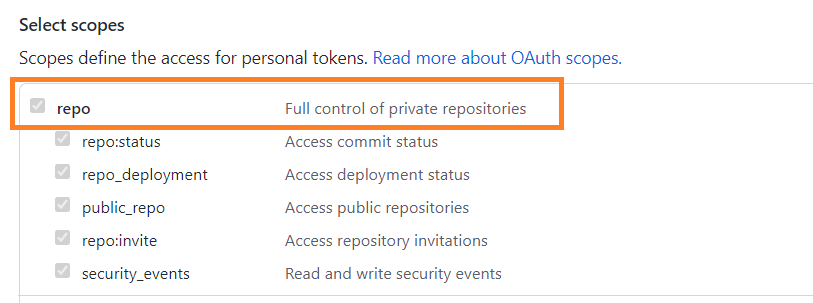

# Advanced Usage

## Integrate Blogpost workflow

PortfolioFy GitHub action can be easily integrated with [Gautam Krishna's Blogpost workflow](https://github.com/marketplace/actions/blog-post-workflow) which enables you to display your latest blog post from various sources such as Medium, dev. to, hash node, or any other WordPress/RSS supported feed. 

To display your blog feed using this action, follow these steps:

- [Enable blogs paramter](./pages/Git-Actions-Parameters.md) in main workflow file

```yml
.
.
.
- uses: actions/checkout@v2
        - uses: kaustubhgupta/PortfolioFy@main
          with:
            gh_token: ${{ secrets.TOKEN }} 
            blogs: True
```

-  Create a new file, name it anything but with extension `.yml`, and copy-paste the following starter code:

```yml
name: Latest blog post workflow
on:
  schedule:
    - cron: '0 0 * * *'
  workflow_dispatch:
  push: # Every time index.html is pushed, this action runs and updates the blogs section!

jobs:
  update-readme-with-blog:
    runs-on: ubuntu-latest
    steps:
      - uses: actions/checkout@v2
      - uses: gautamkrishnar/blog-post-workflow@master
        with:
          feed_list: <Your feedlist>
          max_post_count: <Your Choice>
          readme_path: index.html
          template: "<h2 class='h2-blog'><a class='a-lightblue' href=$url>$title</a></h2>" # It is suggested not to modify this
          gh_token: ${{ secrets.TOKEN }}
```

_Note: DO NOT modify template and parameter of this file_

- Now, every time the index.html file is pushed to the repository, this action will run and check if new blogs need to be updated. 

## Private Repositories Setup

You can easily setup this action a private repository. This will allow you to hide the source code for the webpage and the action continue to push files to the repository. This thing only requires you to allow extra permissions to the access token.



## GitHub Stats Customization

Coming Soon...