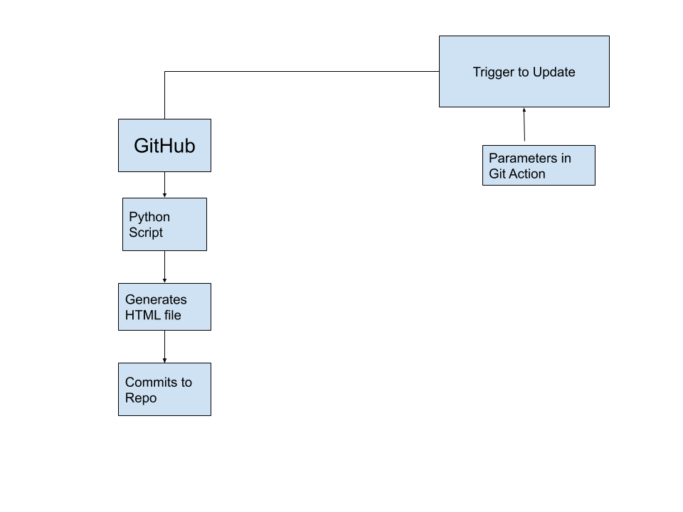

# Idea
A Portfolio presents a skill score sheet for any person. It gives an overall preview of what a person is capable of, their interest, and work samples. In any industry, it is important to prepare a portfolio at least one time. A developer is usually occupied with many tasks, and sometimes it becomes difficult to manually update the information every time. This project tries to solve this problem via automation and scheduled tasks.

GitHub is home to almost every developer and they spend a lot of time syncing their projects with GitHub. This profile can be deciding factor for companies to choose an ideal candidate. Not only this, GitHub offers many features that help developers during their development journey. Automatic code reviews, project versioning, releases, tags, branching, storage, free domain and hosting (under developer student pack), and private repositories, the list is countless, and all this for free! 

Therefore, I decided to use the already available information from GitHub and some additional inputs from users to create a self-updating portfolio that eliminates the need for manually editing the information. For this automation purpose, I choose GitHub actions along with GitHub pages to completely free developers from making a single change in files. Once all things are configured, you don't need to do anything!

# Basic Workflow
(_Note: Here the word "workflow" is not for GitHub actions workflow!_)

GitHub is the warehouse of any developer's development work, and that's why it will be the main source of information for us. Fortunately, as GitHub is an open-source platform, it provides user data access via API(Application Program Interface) that can be parsed using any programming language. I used Python for this purpose. GitHub provides access to whole data but we require only the important project repositories or [hackathons repositories (if opted)](./pages/Git-Actions-Parameters). To tackle this, one needs to manually assign the label of `project` to the repositories to be included in the projects section and `hackathon` for the hackathon section.

After the data is required data is cleaned up and stored in the appropriate structure, the script checks if there exists a portfolio file. If there is no file, an index file is committed to the repository. And if there exists a file, the script checks if there are any changes in the file generated and already available file. The script only commits the file if it detects any change in the file. 

As this is a web portfolio, hosting is needed which can serve all day. GitHub again comes to the rescue! It provides free hosting for static pages via GitHub pages. The index file generated needs to be in any repository. Turning on the GitHub page feature will deploy the website without any recurring costs!